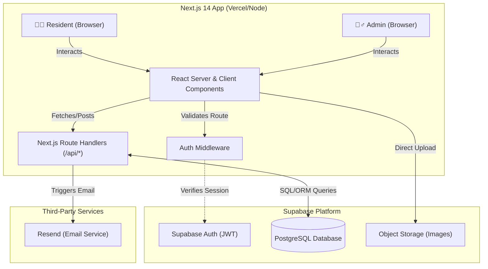
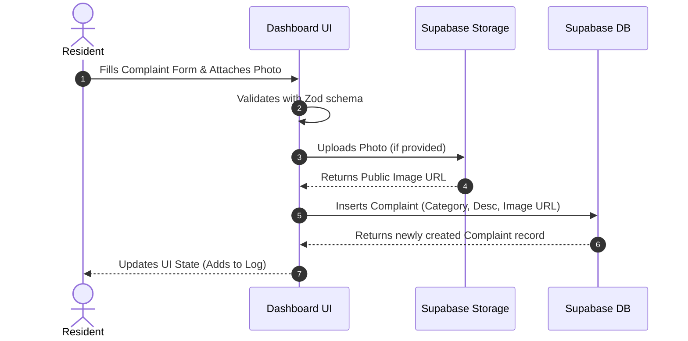
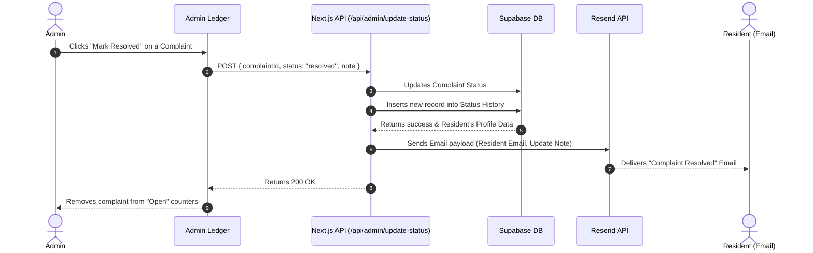

# Society-Fix Resident Portal & Administrative Journal

### Live - https://society-fix-pi.vercel.app/

Society-Fix is a premium, high-aesthetic community management platform built for modern campuses and residential societies. Designed with a custom "Concrete & Ink" municipal ledger theme, it streamlines apartment maintenance tracking, complaint resolution, and critical community announcements.

The application features a seamless **Light & Dark mode** toggle, prioritizing robust data visualization, clean typography, and a dynamic user experience suitable for a professional assessment.


---

## 🔍Project Showcase

### Resident Complaint Portal


### Complaint Management Dashboard + Export


### Complaint Details & Status Update


### Administrative Analytics Dashboard


### Automated Email Notification System


### Administrator Notice Management


### Resident Community Notice Board


---

## 💪Key Features

### Resident Workspace (`/dashboard` & `/notices`)
- **Portal Auth**: Secure signups collecting Full Name, Unit/Wing, and Phone metadata.
- **Defect Ledger**: File repair requests (Plumbing, Electrical, Cleaning, etc.) validated via React Hook Form + Zod.
- **Evidence Vault**: Secure image uploads to a dedicated Supabase Storage bucket.
- **Chronological Timeline**: View interactive pop-up cards tracing the status and note history of filed issues.
- **Resolution Rating System**: Residents can rate resolved complaints (1-5 stars) and leave feedback.
- **Corkboard Circulars**: A pinboard styled with hand-angled paper notes showing notices, prioritizing important updates at the top.

### Administrator Journal (`/admin` & `/admin/notices`)
- **Tabbed Interface**: Seamlessly switch between the Analytics dashboard and the Master Ledger.
- **Analytics & Overview Tab**: Live summary counters, KPIs (Resolution Rate), Recharts bar graph for departmental distribution, and line charts for weekly filing trends.
- **Master Ledger**: View all complaints, wing numbers, category badges, and filing dates with sticky layout structures and independent scrolling.
- **Advanced Filtering & Search**: Filter the master ledger by Status, Category, Date range, and perform full-text searches across names, units, and descriptions.
- **Data Export**: Export the filtered master ledger to CSV or print it as a formatted PDF.
- **Maintenance Controls**: Alter priority tiers, log actions, and update statuses. Resolved tickets are permanently locked.
- **Official Notice Boards**: Publish new announcements and broadcast batch email digests to all residents.

### Platform Wide
- **Theme Toggle**: Seamless switching between Light (default) and Dark mode, persisting user preference via `localStorage`.
- **Responsive Layout**: Works flawlessly on both desktop and mobile devices.

---

## 🏗 Architecture

Society-Fix is built on a modern, decoupled architecture leveraging the Next.js App Router for server-side rendering (SSR) and seamless API integration.



The system is organized into three primary layers:
1. **Presentation Layer**: Built with React (Client and Server Components). Tailwind CSS provides the atomic styling, while Recharts handles the dashboard analytics rendering.
2. **Application & API Layer**: Next.js route handlers manage sensitive operations like updating complaint statuses and broadcasting email notices, keeping API keys (like Resend) secure on the server. Next.js Middleware intercepts requests to enforce role-based access control (RBAC), ensuring residents cannot access the `/admin` workspace.
3. **Data Layer**: Supabase acts as the backend-as-a-service. It handles PostgreSQL database hosting, Row Level Security (RLS) policies to protect resident data, Authentication (JWT), and Object Storage for evidence photos.

---

## 🔄 Data Flow

The data flow ensures that resident actions are immediately reflected in the database and that administrators are equipped to take action while residents are kept in the loop via automated emails.

### 1. Filing a Complaint & Uploading Evidence



### 2. Admin Resolution & Automated Notifications



---

## 🛠 Tech Stack
- **Framework**: Next.js 14 (App Router, middleware-protected routes)
- **Database / Auth**: Supabase PostgreSQL & Supabase SSR Auth
- **Email Service**: Resend SDK
- **Forms & Validation**: React Hook Form + Zod
- **Visuals**: Tailwind CSS, Recharts, Lucide React icons
- **Theming**: CSS Variables (Light/Dark mode via `data-theme`)

---

## 🚀 Getting Started

### 1. Database Setup (Supabase)
Create a new Supabase project and execute the following SQL in the SQL Editor to build the schemas, trigger functions, and security policies:

```sql
-- Create profiles table
CREATE TABLE public.profiles (
    id UUID PRIMARY KEY REFERENCES auth.users(id) ON DELETE CASCADE,
    full_name TEXT NOT NULL,
    apartment_no TEXT NOT NULL,
    phone TEXT,
    role TEXT NOT NULL DEFAULT 'resident',
    created_at TIMESTAMP WITH TIME ZONE DEFAULT timezone('utc'::text, now()) NOT NULL
);

-- Enable RLS on profiles
ALTER TABLE public.profiles ENABLE ROW LEVEL SECURITY;

-- Profiles Policies
CREATE POLICY "Allow public read access to profiles" ON public.profiles FOR SELECT USING (true);
CREATE POLICY "Allow individuals to update their own profile" ON public.profiles FOR UPDATE USING (auth.uid() = id);

-- Create complaints table (includes rating columns)
CREATE TABLE public.complaints (
    id UUID PRIMARY KEY DEFAULT gen_random_uuid(),
    resident_id UUID NOT NULL REFERENCES public.profiles(id) ON DELETE CASCADE,
    apartment_no TEXT NOT NULL,
    category TEXT NOT NULL,
    priority TEXT NOT NULL,
    description TEXT NOT NULL,
    status TEXT NOT NULL DEFAULT 'open',
    photo_url TEXT,
    rating INTEGER CHECK (rating >= 1 AND rating <= 5),
    rating_comment TEXT,
    created_at TIMESTAMP WITH TIME ZONE DEFAULT timezone('utc'::text, now()) NOT NULL,
    updated_at TIMESTAMP WITH TIME ZONE DEFAULT timezone('utc'::text, now()) NOT NULL
);

-- Enable RLS on complaints
ALTER TABLE public.complaints ENABLE ROW LEVEL SECURITY;

-- Complaints Policies
CREATE POLICY "Residents can view their own complaints" ON public.complaints FOR SELECT USING (auth.uid() = resident_id OR (SELECT role FROM public.profiles WHERE id = auth.uid()) = 'admin');
CREATE POLICY "Residents can insert complaints" ON public.complaints FOR INSERT WITH CHECK (auth.uid() = resident_id);
CREATE POLICY "Admins can update complaints" ON public.complaints FOR UPDATE USING ((SELECT role FROM public.profiles WHERE id = auth.uid()) = 'admin');

-- Create complaint_status_history table
CREATE TABLE public.complaint_status_history (
    id UUID PRIMARY KEY DEFAULT gen_random_uuid(),
    complaint_id UUID NOT NULL REFERENCES public.complaints(id) ON DELETE CASCADE,
    status TEXT NOT NULL,
    note TEXT,
    created_at TIMESTAMP WITH TIME ZONE DEFAULT timezone('utc'::text, now()) NOT NULL
);

-- Enable RLS on complaint_status_history
ALTER TABLE public.complaint_status_history ENABLE ROW LEVEL SECURITY;

-- Policies for complaint_status_history
CREATE POLICY "Users can view status history of their complaints" ON public.complaint_status_history FOR SELECT USING (
    EXISTS (
        SELECT 1 FROM public.complaints 
        WHERE id = complaint_id 
        AND (resident_id = auth.uid() OR (SELECT role FROM public.profiles WHERE id = auth.uid()) = 'admin')
    )
);
CREATE POLICY "Admins can insert status history" ON public.complaint_status_history FOR INSERT WITH CHECK ((SELECT role FROM public.profiles WHERE id = auth.uid()) = 'admin');

-- Create notices table
CREATE TABLE public.notices (
    id UUID PRIMARY KEY DEFAULT gen_random_uuid(),
    title TEXT NOT NULL,
    body TEXT NOT NULL,
    is_important BOOLEAN NOT NULL DEFAULT false,
    author TEXT NOT NULL DEFAULT 'SUPERINTENDENT',
    created_at TIMESTAMP WITH TIME ZONE DEFAULT timezone('utc'::text, now()) NOT NULL
);

-- Enable RLS on notices
ALTER TABLE public.notices ENABLE ROW LEVEL SECURITY;

-- Notices Policies
CREATE POLICY "Allow public select on notices" ON public.notices FOR SELECT USING (true);
CREATE POLICY "Allow admin insert on notices" ON public.notices FOR INSERT WITH CHECK ((SELECT role FROM public.profiles WHERE id = auth.uid()) = 'admin');
CREATE POLICY "Allow admin delete on notices" ON public.notices FOR DELETE USING ((SELECT role FROM public.profiles WHERE id = auth.uid()) = 'admin');

-- Trigger to create profile on user signup
CREATE OR REPLACE FUNCTION public.handle_new_user()
RETURNS trigger AS $$
BEGIN
  INSERT INTO public.profiles (id, full_name, apartment_no, phone, role)
  VALUES (
    new.id,
    COALESCE(new.raw_user_meta_data->>'full_name', ''),
    COALESCE(new.raw_user_meta_data->>'apartment_no', ''),
    COALESCE(new.raw_user_meta_data->>'phone', ''),
    COALESCE(new.raw_user_meta_data->>'role', 'resident')
  );
  RETURN new;
END;
$$ LANGUAGE plpgsql SECURITY DEFINER;

CREATE TRIGGER on_auth_user_created
  AFTER INSERT ON auth.users
  FOR EACH ROW EXECUTE FUNCTION public.handle_new_user();
```

### 2. Storage Setup
Inside the Supabase Dashboard:
1. Go to **Storage**.
2. Click **New Bucket**.
3. Name the bucket `complaint-photos`.
4. Make the bucket **Public**.
5. Set up a Storage Policy allowing public read access to images, and authenticated users to upload folders.

### 3. Local Configuration
Create a `.env.local` file in the root directory (matching the structure of `.env.example`):
```bash
NEXT_PUBLIC_SUPABASE_URL=your_supabase_project_url
NEXT_PUBLIC_SUPABASE_ANON_KEY=your_supabase_anon_key
SUPABASE_SERVICE_ROLE_KEY=your_supabase_service_role_key
RESEND_API_KEY=your_resend_api_key
RESEND_FROM_EMAIL=onboarding@resend.dev
```

### 4. Running Locally
Install dependencies:
```bash
pnpm install
```

Start the development server:
```bash
pnpm run dev
```

Build the production application bundle:
```bash
pnpm run build
```

---

## 🚀 Deployment

This project is optimized for deployment on Vercel. 
1. Push the code to a GitHub repository.
2. Import the project in Vercel.
3. Add the environment variables listed in `.env.local` to the Vercel project settings.
4. Deploy (Vercel automatically detects Next.js and configures the build settings).

---

## 📂 Folder Structure Overview

```text
src/
├── app/
│   ├── admin/             # Protected admin workspace & Recharts dashboard
│   ├── api/               # Next.js Serverless Route Handlers (Resend, Supabase admin)
│   ├── components/        # Reusable UI (Navigation, Skeleton loaders, Dialogs)
│   ├── dashboard/         # Protected resident workspace
│   ├── login/             # Auth interface
│   ├── notices/           # Community pinboard
│   └── globals.css        # Tailwind config, theme variables, and global styles
├── utils/
│   └── supabase/          # Supabase client/server/middleware instantiations
```

---


## 🎨 Design Decisions & UI/UX Philosophy
- **Aesthetic**: Opted for a "Concrete & Ink" municipal ledger aesthetic rather than a generic SaaS dashboard. This gives the application a premium, official, and authoritative feel appropriate for estate management.
- **Typography**: Used `IBM Plex Mono` for tabular data, dates, and timestamps to ensure numbers align perfectly in the ledger, while using `Space Grotesk` for headers to provide a modern edge.
- **Accessibility**: Implemented a CSS variable-based Theme Toggle. The light mode uses a warm, parchment-like off-white (`#F5F4F0`) instead of harsh pure white, reducing eye strain for administrators viewing the screen for long periods.

---

## 🚧 Challenges Faced & Solutions
- **Challenge**: Enforcing secure, role-based data access (ensuring residents cannot view each other's complaints or access the admin panel).
- **Solution**: Implemented strict **Row Level Security (RLS)** policies directly within the Supabase PostgreSQL database. Even if a user attempts to fetch data via the API, the database natively rejects unauthorized requests based on their JWT token role, rather than relying solely on fragile frontend hiding techniques.
- **Challenge**: Managing complex, synchronized state in the Admin Master Ledger (filtering by status, category, date, and full-text search) without causing excessive re-renders.
- **Solution**: Handled primary data fetching server-side, and utilized Next.js client components with memoized filter functions to instantly narrow down the data on the client side, ensuring a snappy, zero-latency search experience.

---


## 🔮 Future Roadmap (v2.0)
- **AI-Powered Categorization**: Automatically assign categories to complaints based on the resident's text description using an LLM.
- **Push Notifications**: Convert the platform into a Progressive Web App (PWA) to send mobile push notifications for urgent circulars.
- **Vendor Portal**: Add a third role (`vendor`) to allow third-party contractors to log in and mark assigned tickets as completed.

